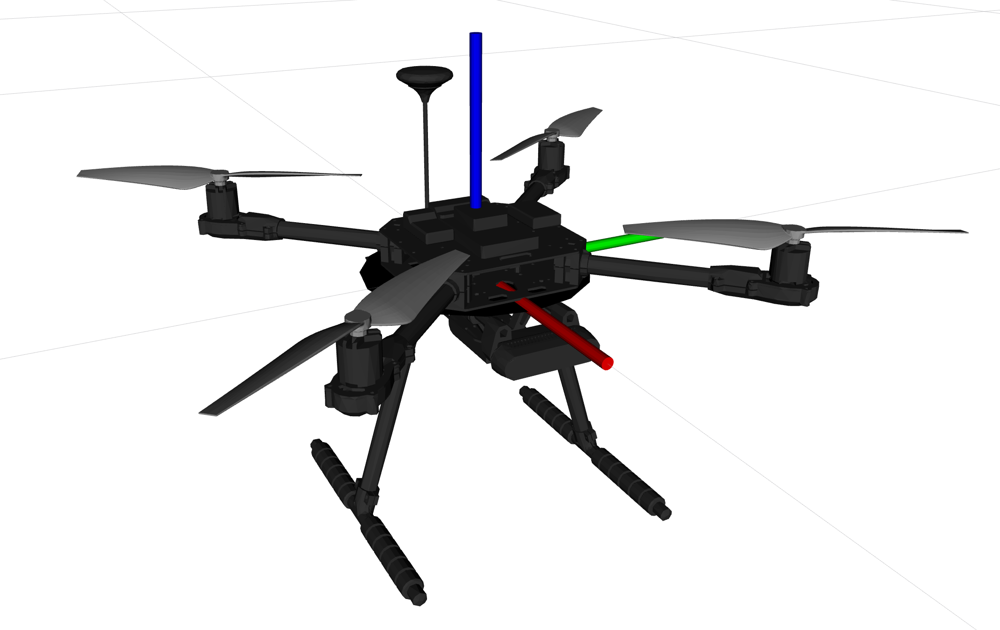

# Digital Twin Cybersecurity for PX4 Drone

ROS2 Packages for simulating the digital twin for Holybro PX4 Quad Drone for cybersecurity attacks and predictive analysis.

### Requirements
- Ubuntu 24.04 (Noble Numbat)
- ROS2 Jazzy
- Gazebo Harmonic



## Usage
To visualize the drone in rviz without the connection
```
source install/setup.bash
ros2 launch x500_drone_description x500_drone_display.launch.py
```
